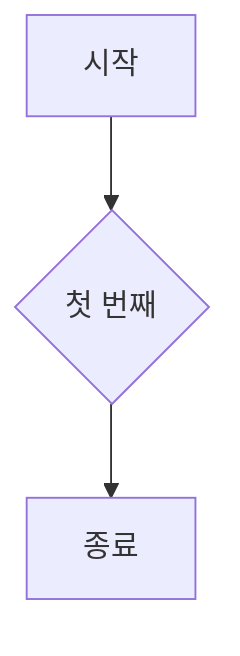
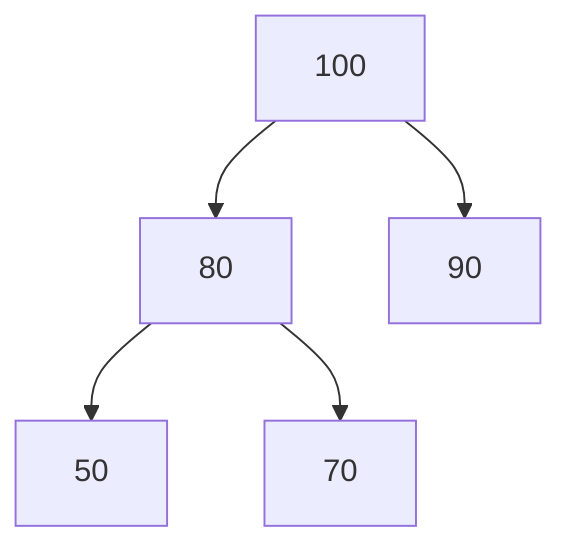
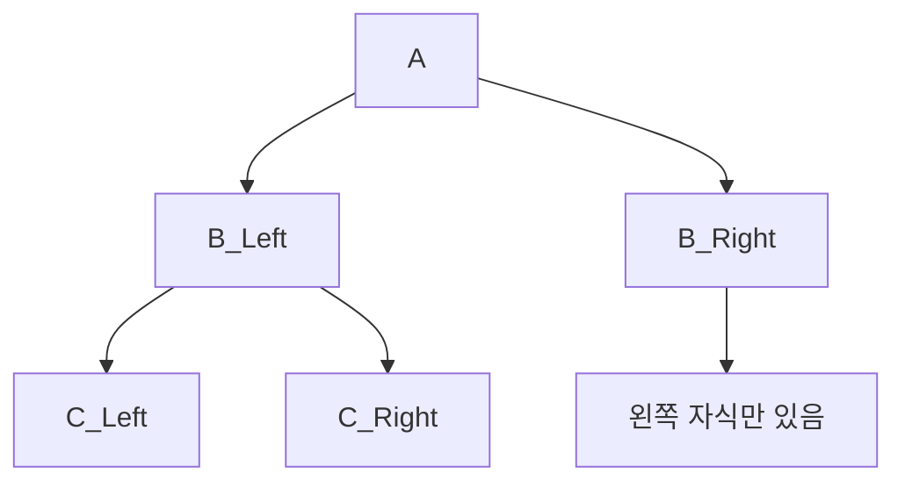

1. task list

- [ ] 운동하기
- [x] 공부하기
- [ ] 커피 마시기

2. admonition

::: warning : ㅇㅇㅇㅇ
 이 작업
:::

::: tip
💡 **팁:** 코드를 잘 나눠서 작성하면 유지보수가 쉬워집니다.
:::

::: info
ℹ️ **정보:** 이 기능은 곧 업데이트 예정입니다.

# 1. 버블 소트

3 2 1 5 4

가 있다고 치자.

i = 0 ~ 4      -1

j = 0 ~ 4-i     -1

가장 큰 숫자를 맨 뒤에 띄운다는 뜻으로 버블소트

그래서

3 2 1 5 4

[2 3] 1 5 4

2 [1 3] 5 4

2 1 [3 5] 4

2 1 3 [4 5]

최종적으로 5를 띄우고, 다음엔 4를 띄우고... 이런 식으로 정렬함.

# 2. 선택 정렬

3 2 1 5 4

가 있다고 치자.

i = 0 ~ 4 -1

j = i+1 ~ 4

이것은 (원래는) 가장 작은 숫자의 [배열 위치]를 기억했다가 마지막에 한번만 교체하는 것이다.

그래서...

i = 0 구간에서 

3 2 1 5 4 : 최소위치 1

3 2 1 5 4 : 최소위치 2

3 2 1 5 4 : 최소위치 3

3 2 1 5 4 : 최소위치 3

3 2 1 5 4 : 최소위치 3

마지막에 [1] 2 3 5 4

이런식

# 3. 삽입 정렬

3 2 1 5 4 

가 있다고 치자

i = 1~4

i=1일때

j = while( i-1 ~ 0 )

3 2 1 5 4

3>2라서, 2의 위치에 3을 오른쪽으로 옮기고, 거기에 2를 넣는다

2 3 1 5 4

i=2일때는 어떤가?

3>1이니 우선 1 위치에 3을 놓는다 2 3 3 5 4 (기억 1)

2>1이니 옆으로 2를 놓는다 2 2 3 5 4 (기억1)

기억한 곳에 1을 놓는다. 1 2 3 5 4

이런 식이다.

# 4. 계수 정렬(정수 한정)

그러니까 이건, [배열을 조작]하지 않고

[배열의 원소 갯수를 센 다음 아예 새 배열을 만드는 식] 이다.

# 5. 힙 소트

일단 힙이 뭔지 알아야 한다

heap 덩어리

1. 힙(Heap)이란?

완전 이진트리(Complete Binary Tree) 형태의 자료구조입니다.

>완전 이진 트리(完全二進-, 영어: complete binary tree) : 마지막 레벨을 제외하고 모든 레벨이 완전히 채워져 있으며, 마지막 레벨의 모든 노드는 가능한 한 가장 왼쪽에 있다

부모 노드와 자식 노드 사이에 특정한 우선순위 조건이 있어요.

크게 두 종류가 있습니다:

최대 힙(Max-Heap): 부모 노드가 자식 노드보다 크거나 같다.

최소 힙(Min-Heap): 부모 노드가 자식 노드보다 작거나 같다.

구분해서 다음 거를 작성

이라고 하는데 채찍이랑 잼민이 둘 다 완전이진트리가 아니라고 했다가 정정당했음

결국 맞네요

아무튼.........

2. 부모 노드는 항상 자식 노드들보다 크거나 같아야 합니다.

하지만, 왼쪽 자식과 오른쪽 자식 간의 크기 비교는 필요하지 않습니다!
