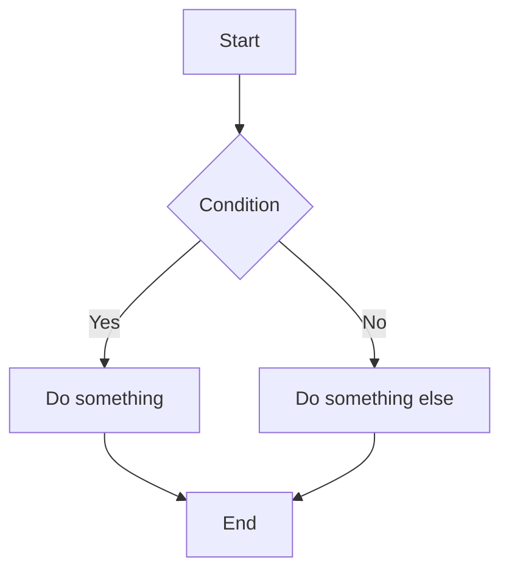
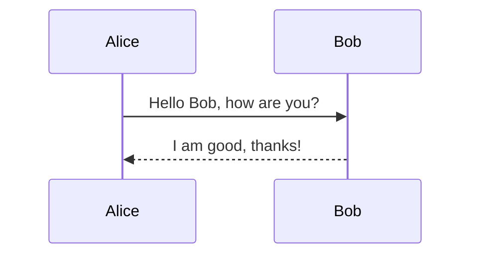
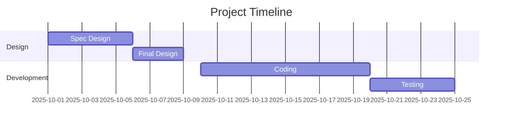
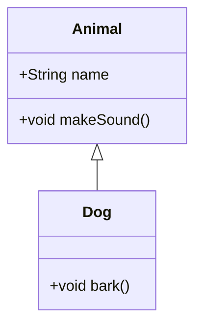
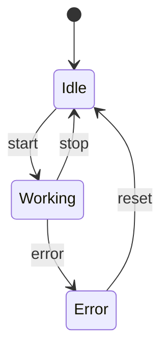
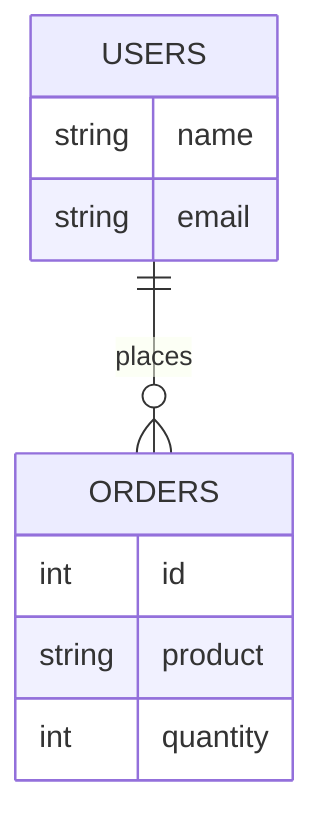
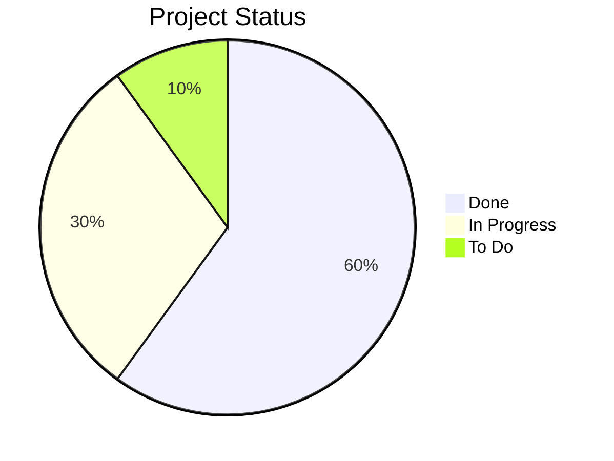
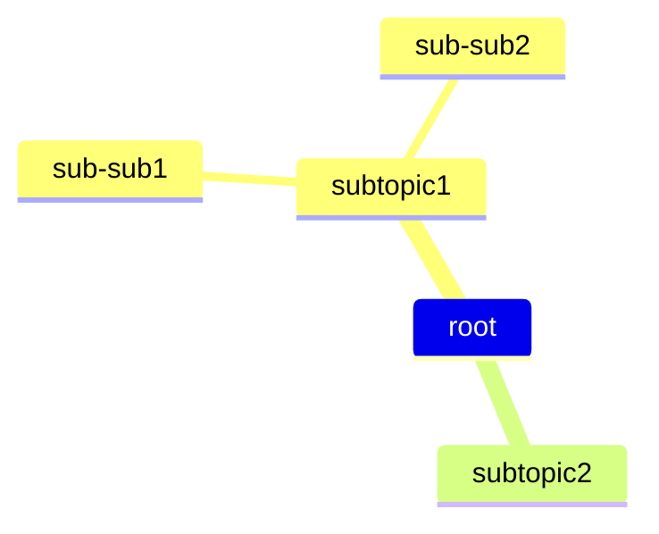

```mermaid
flowchart TD
    A[Start] --> B{Condition}
    B -- Yes --> C[Do something]
    B -- No --> D[Do something else]
    C --> E[End]
    D --> E
```

```mermaid
sequenceDiagram
    participant Alice
    participant Bob
    Alice->>Bob: Hello Bob, how are you?
    Bob-->>Alice: I am good, thanks!
```

```mermaid
gantt
    title Project Timeline
    dateFormat  YYYY-MM-DD
    section Design
    Spec Design :a1, 2025-10-01, 5d
    Final Design :after a1, 3d
    section Development
    Coding :2025-10-10, 10d
    Testing :2025-10-20, 5d
```

```mermaid
classDiagram
    class Animal {
        +String name
        +void makeSound()
    }
    class Dog {
        +void bark()
    }
    Animal <|-- Dog
```

```mermaid
stateDiagram-v2
    [*] --> Idle
    Idle --> Working : start
    Working --> Idle : stop
    Working --> Error : error
    Error --> Idle : reset
```

```mermaid
erDiagram
    USERS ||--o{ ORDERS : places
    USERS {
        string name
        string email
    }
    ORDERS {
        int id
        string product
        int quantity
    }
```

```mermaid
pie
    title Project Status
    "Done" : 60
    "In Progress" : 30
    "To Do" : 10
```

```mermaid
mindmap
  root
    subtopic1
      sub-sub1
      sub-sub2
    subtopic2
```

8개나 있었나
