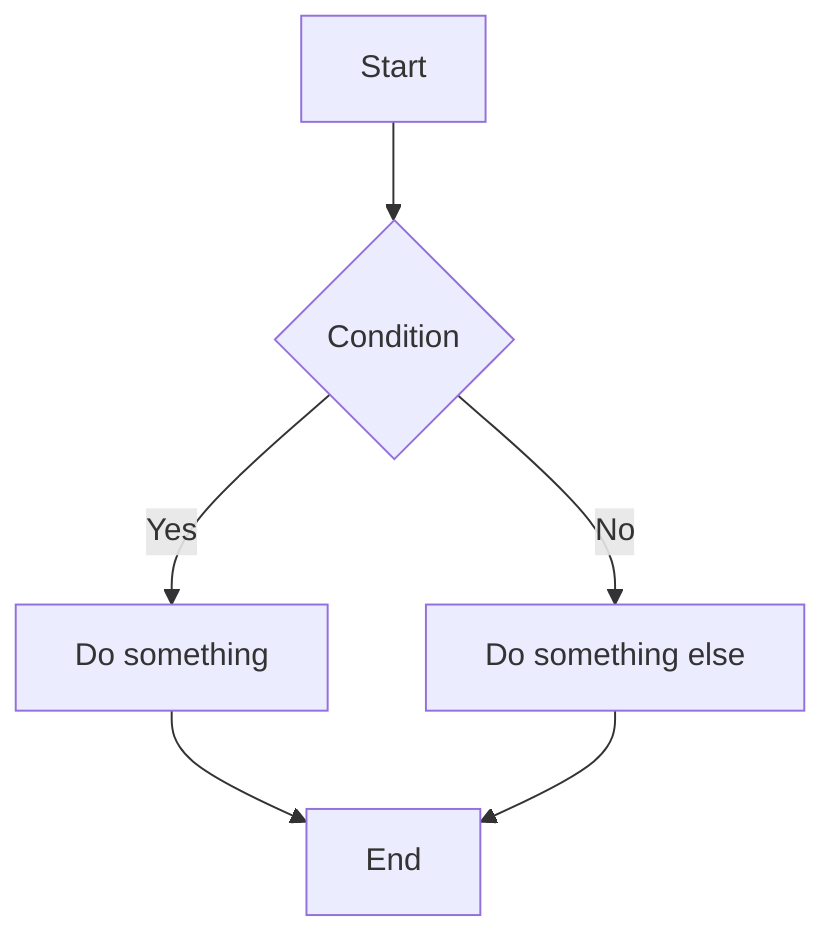
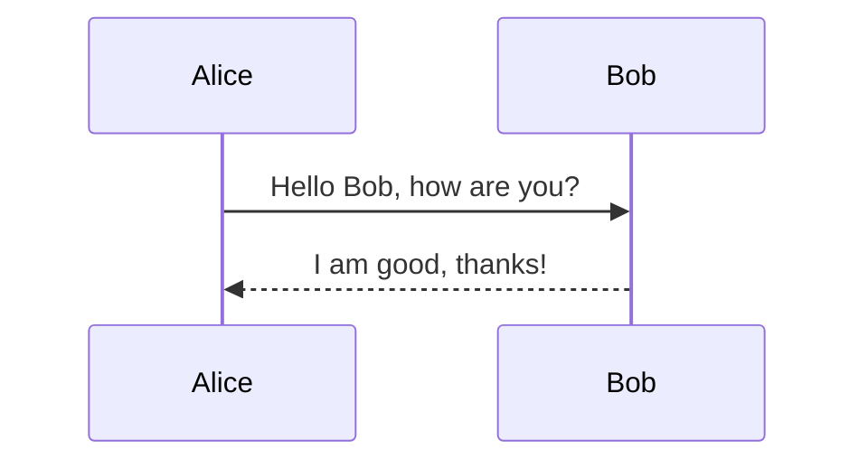
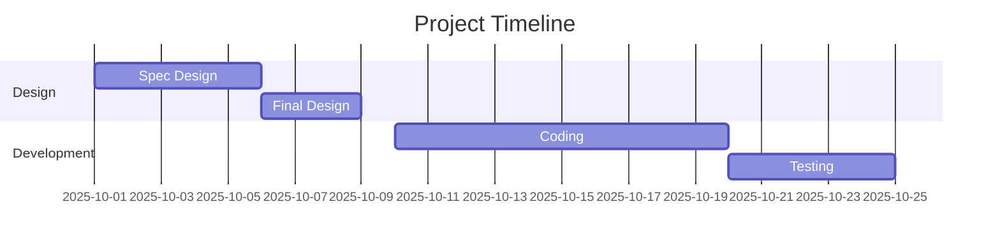
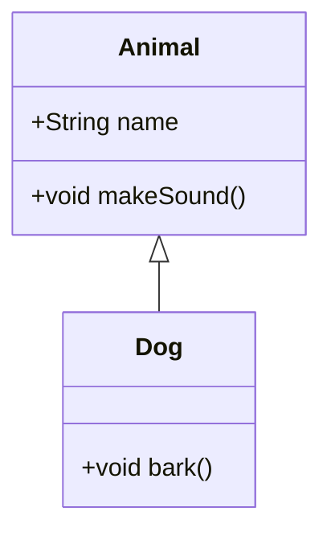
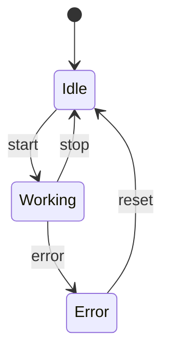
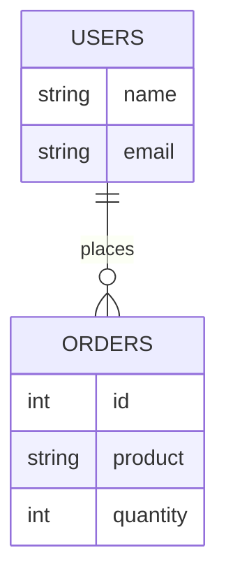
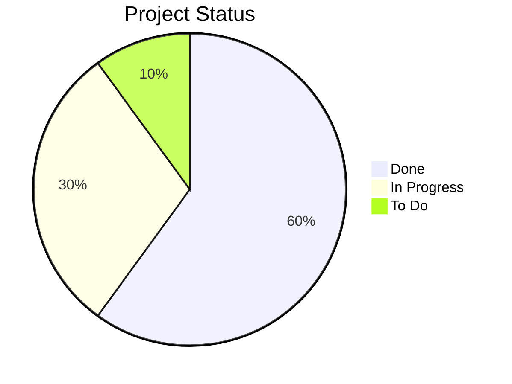
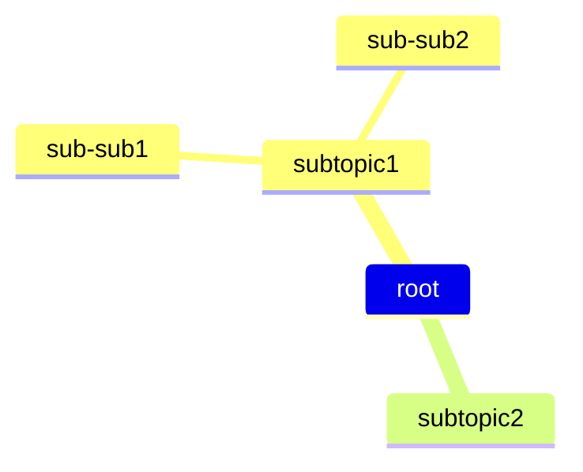
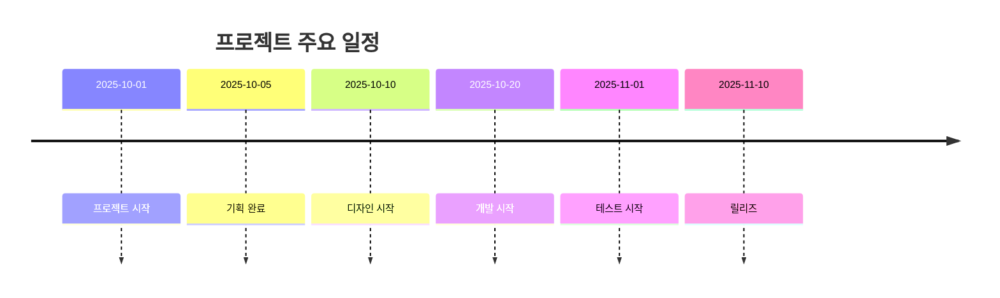

# ✅ 1. Flowchart (순서도)

# ✅ 2. Sequence Diagram (시퀀스 다이어그램

# ✅ 3. Gantt Chart (간트 차트)

# ✅ 4. Class Diagram (클래스 다이어그램)

# ✅ 5. State Diagram (상태도)

# ✅ 6. Entity Relationship Diagram (ERD)

# ✅ 7. Pie Chart (파이 차트)

# ✅ 8. Mindmap (마인드맵)

# ✅ 9. Timeline (타임라인)

