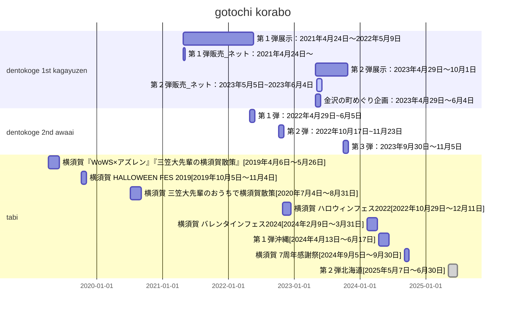

# kaga

２
>https://yostar.co.jp/news/44

# awai

１：https://x.com/azurlane_staff/status/1519582214014775298

２：https://x.com/azurlane_staff/status/1593827681384079360

３：https://x.com/yostarjp_info/status/1707959281977577697

# tabi

２０１９：https://www.cocoyoko.net/event/WOWSxAZ.html

２０１９x2：https://x.com/azurlane_staff/status/1178593747522605056

２０２０：https://www.cocoyoko.net/event/azuren2020.html

２０２２：https://www.cocoyoko.net/azurlane/

ば：https://www.cocoyoko.net/azurlane2024/

１：https://azutabi-okinawa.azurlane.jp/article-stamprally

７：https://www.cocoyoko.net/azurlane_kanshasai

２：https://azutabi-hokkaido.azurlane.jp/article-stamprally

# 영어권 : 900 -> 256 -> 32 -> 4 

## 1. 1회전 : utc-7 로 2025/10/10 2am은 한국 시간으로?

UTC-7 (미국 서부 시간대 등에서 사용) 기준으로 

2025년 10월 10일 오전 2시는 

한국 시간(KST, UTC+9)으로 

2025년 10월 10일 오후 6시입니다.

## 2. 2회전 : utc-7 로 2025/10/10 8pm ~ 10/12 2am은 한국 시간으로?

한국 시간(KST, UTC+9)으로 

2025년 10월 11일 토 오후 12시부터 

2025년 10월 12일 일 오후 6시까지입니다.

## 3회전 : utc-7 로 2025/10/12 8pm ~ 10/13 8am은 한국 시간으로?

2025년 10월 13일 정오 12:00부터

2025년 10월 14일 자정 12:00까지

## 그룹A회전 : utc-7 로 2025/10/16 7pm은 한국 시간으로?

2025년 10월 17일(금요일) 오전 11시~

# 한국권 : 900 -> 256 -> 32 -> 4 

## 1. ~ 10/10 금 22시까지

900명

## 2. 10/11 토 14시 ~ 10/12 일 22시

256명

## 3. 10/13 월 14 ~ 22시, 10/14 화 14 ~ 22시

32명

## 4. 10/17 금 19 or 10/18 토 19시

상위 2

## 5. 10.19 일 19

